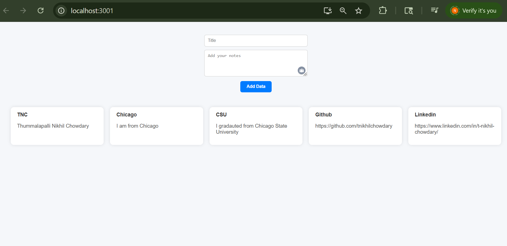

# Notes App (React)

A simple and elegant note-taking app built with **React.js**. This app allows users to write, view, and manage personal notes right from their browser.

---

##  Features

- Create and add new notes
- Display a list of notes


---
## Screenshot




## echnologies Used

- React
- useState Hook

---

## Getting Started

Follow these steps to run the project locally:

### 1. Clone the Repository
```bash
git clone https://github.com/tnikhilchowdary/notes-app-react.git
cd notes-app-react
